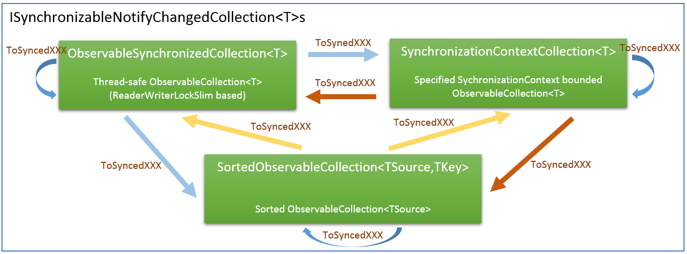
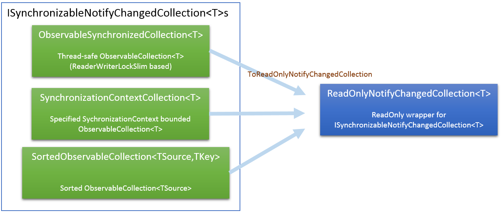
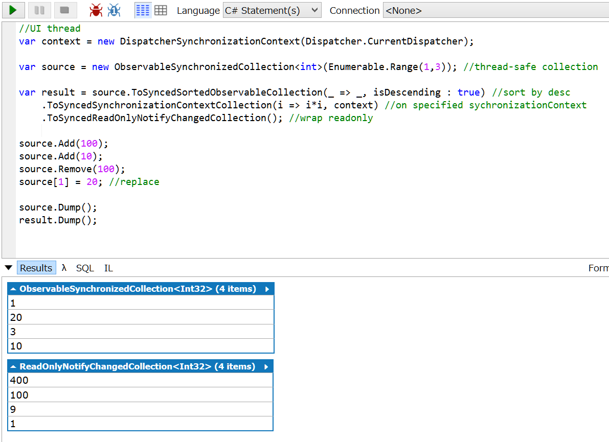
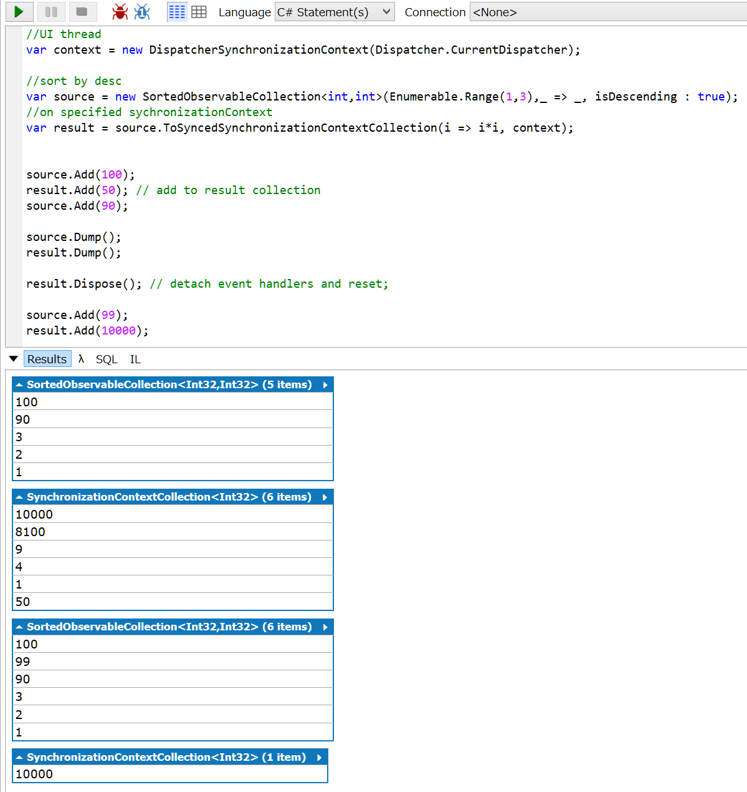

## Livet.StatefulModel

Livet.StatefulModel collections is a copy of StatefulModel.
Original is using `StatefulModel` namespace, this package is using `Livet.StatefulModel` namespace.

### NotifyCollections

the classes that implement `ISynchronizableNotifyChangedCollection<T>` have ToSyncedXXX Methods (XXX ... any `ISynchronizableNotifyChangedCollection<T>`).

ToSyncedXXX Methods is creating one-way synchronized collection with source collection. 




#### Simple Usage
```csharp
	//thread-safe collection
	var source = new ObservableSynchronizedCollection<int>(Enumerable.Range(1,3));
	// sorted collection
	var sortedSource = new SortedObservableCollection<int,int>(Enumerable.Range(1,4),i => i);
	//UI thread
	var context = new DispatcherSynchronizationContext(Dispatcher.CurrentDispatcher);
	//SynchronizationContext(send) bouded collection.
	var dispatcherSource = new SynchronizationContextCollection<int>(Enumerable.Range(1,5),context);
```

#### Sync Collections
While creating one-way synchronized collection, this method lock source collection, so no leak items.


#### Detach
`ISynchronizableNotifyChangedCollection<T>` is IDisposable. When Dispose() called , all EventHandler from source collection will be detached.

